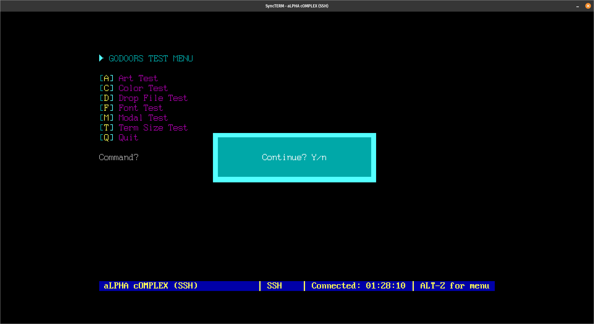

# GoDoors

Helpful library for creating linux-based door applications (like games and utilities) for BBSs that utilize STDIN and STDOUT, when connected over a terminal program like [SyncTerm](https://syncterm.bbsdev.net/), [MagiTerm](https://gitlab.com/magickabbs/MagiTerm), [NetRunner](http://mysticbbs.com/downloads.html) or [IGTerm](https://www.phenomprod.com/).

If you're not already running linux-based BBS software like [Talisman](https://talismanbbs.com/), [Mystic](http://mysticbbs.com/downloads.html), [Synchronet](https://wiki.synchro.net/install:nix), [ENiGMA½](https://enigma-bbs.github.io/) or [WWIV](https://github.com/wwivbbs/wwiv), then this library probably isn't for you.

----
 

## Install
```go
go get github.com/robbiew/godoors
```

## Usage
```go
import (
    gd "github.com/robbiew/godoors"
)
```


## DROP FILES

```go 
gd.DropFileData(path string) (string, int, int)
```

> Pass the path of the [door32.sys](https://raw.githubusercontent.com/NuSkooler/ansi-bbs/master/docs/dropfile_formats/door32_sys.txt) drop file PARENT FOLDER (including trailing slash), and it will return HANDLE/ALIAS, TIME LEFT (in minutes), EMULATION TYPE (0 = Ascii, 1 = Ansi) and NODE NUMBER. You can check out the [main.go](examples/main.go) to see it in action using FLAG to handle the ```-path``` command line argument for the folder location.
> Only door32.sys is supported at this time.

```go
go run main.go -path ./
```

***
 
## GET TERMINAL HEIGHT AND WIDTH
```go
gd.GetTermSize() (int, int)
```

> Tries to detect the user's terminal size. Returns HEIGHT and WIDTH. If it can't detect it, it'll default to 25 and 80.

***
## DISPLAY ANSI ART
```go
gd.PrintAnsi(file string, delay int) 
```

> Pass the valid path of an ANSI art file and it'll strip the SAUCE record, then print it line by line, with an optional delay (in milliseconds, e.g. 40) to simulate slower speeds.

***
## DISPLAY SOMETHING AT X,Y COORDINATES
```go
gd.PrintAnsiLoc(file string, x int, y int)
gd.PrintStringLoc(text string, x int, y int)
```

> Same as above, only it'll print the art to the screen at X,Y coordinates, incrementing the Y position after every line. Handy of you need to update the screen with art in a particular location without clearing and re-writing everything.

***
## PAUSE
```go
gd.Pause()
```

> Hit any key 

***
## CONTINUE Y/N PROMPT
```go
gd.Continue()
```

> No cancels, Yes does... something else.

***
## POP UP STYLE MODAL
```go
gd.Modal(text string, l int, w int, h int)

```

> currently coded to display a background ANSI file with a "Continue? Y/n" prompt/

***

## CENTER SOMETHING (text, art, etc.)
```go
gd.AbsCenterText(s string, l int, w int, h int, c string) 
gd.AbsCenterArt(file string, l int, w int, h int) 
gd.CenterText(s string, w int) 
```
> "absolute center" being both vertically an horizontally centered based in the terminal height and width.

***

## Cursor related

```go
// Move the cursor n cells to up.
gd.CursorUp(n int) 

// Move the cursor n cells to down.
gd.CursorDown(n int) 

// Move the cursor n cells to right.
gd.CursorForward(n int) 

// Move the cursor n cells to left.
gd.CursorBack(n int) 

// Move cursor to beginning of the line n lines down.
gd.CursorNextLine(n int) 

// Move cursor to beginning of the line n lines up.
gd.CursorPreviousLine(n int) 

// Move cursor horizontally to x.
gd.CursorHorizontalAbsolute(x int) 

// Show the cursor.
gd.CursorShow() 

// Hide the cursor.
gd.CursorHide()
```
***
## Color
```go
// Text colors supported by BBS term programs
// usage: fmt.Println(gd.Yellow)
gd.Black         
gd.Red          
gd.Green         
gd.Yellow     
gd.Blue        
gd.Magenta      
gd.Cyan         
gd.White         
gd.BlackHi   
gd.RedHi      
gd.GreenHi     
gd.YellowHi    
gd.BlueHi      
gd.MagentaHi   
gd.CyanHi     
gd.WhiteHi     

// Background colors
gd.BgBlack        
gd.BgRed          
gd.BgGreen        
gd.BgYellow       
gd.gd.BgBlue          
gd.BgMagenta       
gd.BgCyan          
gd.BgWhite         
gd.BgBlackHi     
gd.BgRedHi       
gd.BgGreenHi     
gd.BgYellowHi   
gd.BgBlueHi     
gd.BgMagentaHi   
gd.BgCyanHi      
gd.BgBWhiteHi     

// Reset to default colors
gd.Reset 
```
***
## FONTS
```go
// Supported by SyncTerm
// usage: fmt.Println(gd.Topaz)
gd.Mosoul        
gd.Potnoodle     
gd.Microknight    
gd.Microknightplus 
gd.Topaz          
gd.Topazplus      
gd.Ibm 
gd.Ibmthin         
```

***

## MISC
See [godoors.go](godoors.go) for other misc. functions.
- Configurable idle/exit timer
- Menu loop

## TO-DO
- ~~Time-out if no key press in X mins~~
- ~~Pop-up style window~~
- ~~Pause sequence (press any key to continue)~~
- ~~Confirm Y/n prompt~~
- ~~Get single key press from keyboard~~
- Get text input, max X characters
- ~~Idle/timeout timer example~~
- Write user data to text file
- Create a leader or score board
- Write user data to sqlite file
- Retrive/parse/display JSON data from the Internet APIs (16 colors, news, weather, etc.)
- Retrieve an ANSI file from the internet and display
- Add entry to end of log file
- Tidy on exit
- Save & Restore cursor position
- Create a scrollable/selectable list of things
- ANSI art file manipulation (scroll up/down, left/right)
- SIXEL support!
